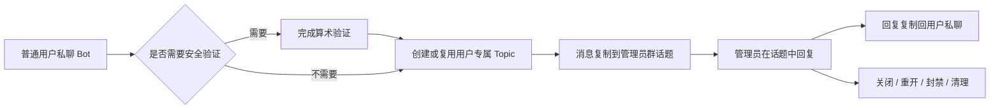

# Telegram 客服中继机器人（Go）

一个基于 Go 与 Telegram Forum Topics 的轻量级客服中继机器人。

用户私聊机器人后，机器人会在管理员超级群中为该用户创建独立话题，并在用户私聊与管理员话题之间双向复制消息。管理员可以直接在 Telegram 群组中回复、关闭、重开、封禁、解封、清理会话或发送广播。

> **重要权限规则：** 普通用户不能主动关闭、取消、结束或重新打开对话。会话生命周期只能由配置在 `ADMIN_USER_IDS` 中的管理员控制。

## 目录

- [主要功能](#主要功能)
- [工作流程](#工作流程)
- [运行要求](#运行要求)
- [Telegram 准备工作](#telegram-准备工作)
- [快速开始](#快速开始)
- [配置说明](#配置说明)
- [普通用户教程](#普通用户教程)
- [管理员教程](#管理员教程)
- [安全验证机制](#安全验证机制)
- [会话状态与管理规则](#会话状态与管理规则)
- [开发者指南](#开发者指南)
- [测试与代码检查](#测试与代码检查)
- [构建 Linux AMD64](#构建-linux-amd64)
- [部署到 Linux](#部署到-linux)
- [数据库与升级兼容](#数据库与升级兼容)
- [安全建议](#安全建议)
- [常见问题](#常见问题)

## 主要功能

- 用户私聊与管理员 Forum Topic 双向中继
- 每位普通用户自动对应一个独立客服话题
- 支持文字、图片、动画、音频、文件、视频、语音、贴纸、位置、联系人、投票等 Telegram 消息
- 支持媒体组聚合转发、回复引用映射和已编辑消息同步
- 支持加、减、乘、除四种算术安全验证
- 验证通过后自动补发验证前暂存的消息
- 用户与管理员拥有不同的命令菜单和常驻快捷键盘
- 管理员可查询用户状态、封禁列表和消息统计
- 管理员可关闭、重开、封禁、解封、清理用户会话
- 管理员可通过回复消息向全部可接收用户广播
- 管理员不能封禁自己，也不能封禁其他管理员
- 管理员账号不会被当作普通客服用户创建会话
- 旧数据库中的管理员记录会从广播目标和封禁列表中排除
- SQLite 自动建表、兼容旧字段，并支持并发读写
- 支持多 Worker、长轮询和 HTTP 连接池参数调整

## 工作流程



机器人使用 Telegram 的消息复制能力进行中继，不会把普通用户加入管理员群。管理员只需在用户对应话题中正常回复即可。

## 运行要求

- Go `1.22` 或更高版本
- 一个通过 BotFather 创建的 Telegram Bot
- 一个已开启 **Topics（话题）** 的 Telegram **Supergroup（超级群）**
- 一个或多个 Telegram 管理员用户 ID
- 可访问 Telegram Bot API 的网络环境

项目使用纯 Go SQLite 驱动。构建 Linux AMD64 版本时可设置 `CGO_ENABLED=0`，目标服务器不需要额外安装 SQLite 动态库。

## Telegram 准备工作

### 1. 创建机器人

1. 在 Telegram 中打开 BotFather。
2. 使用 `/newbot` 创建机器人。
3. 保存 BotFather 返回的 Token。
4. 将 Token 写入 `.env` 的 `BOT_TOKEN`。

不要把真实 Token 写入 README、提交记录、截图或公开日志。如果 Token 已泄露，请立即在 BotFather 中重新生成。

### 2. 创建管理员超级群

1. 创建一个 Telegram 群组并升级为超级群。
2. 在群组设置中开启 Topics/话题功能。
3. 将机器人加入群组并设为管理员。
4. 授予机器人发送消息、管理话题和删除消息等权限。
5. 将超级群数字 ID 写入 `ADMIN_GROUP_ID`。

超级群 ID 通常是以 `-100` 开头的负数。启动时程序会检查该 ID 是否可访问、是否为超级群以及是否已开启话题，不符合要求时会直接返回错误。

### 3. 配置管理员

将管理员的 Telegram 数字 ID 写入 `ADMIN_USER_IDS`，多个 ID 使用英文逗号分隔：

```env
ADMIN_USER_IDS=123456789,987654321
```

只有这里明确列出的账号拥有管理权限。Telegram 群组中的“管理员”身份不会自动获得机器人管理权限。

## 快速开始

### 1. 准备配置

Linux/macOS：

```bash
cp .env.example .env
```

PowerShell：

```powershell
Copy-Item .env.example .env
```

编辑 `.env`，至少填写：

```env
BOT_TOKEN=123456789:replace-with-your-token
ADMIN_GROUP_ID=-1001234567890
ADMIN_USER_IDS=123456789,987654321
```

### 2. 开发模式运行

```bash
go run ./cmd/bot
```

启动成功后，日志会显示机器人用户名、管理员群、数据库路径、Worker 数量和验证开关等信息。

### 3. 检查基本流程

1. 管理员私聊机器人发送 `/start`，确认出现管理员面板。
2. 普通账号私聊机器人发送 `/start`。
3. 普通账号发送测试消息，并按提示完成算术验证。
4. 检查管理员群中是否自动创建用户话题。
5. 在该话题中回复，确认用户私聊能收到消息。
6. 在该话题中测试 `/close` 和 `/open`。

## 配置说明

程序会尝试读取当前目录的 `.env`，也兼容从上一级目录读取 `.env`。操作系统环境变量优先于 `.env` 中的同名配置。

| 变量 | 必填 | 默认值 | 说明 |
|---|---:|---|---|
| `APP_NAME` | 否 | `interactive-bot` | 管理员面板和日志中的应用名称 |
| `BOT_TOKEN` | 是 | 无 | BotFather 提供的机器人 Token |
| `WELCOME_MESSAGE` | 否 | `欢迎使用本机器人` | 普通用户执行 `/start` 时显示的欢迎语 |
| `ADMIN_GROUP_ID` | 是 | 无 | 已开启 Topics 的管理员超级群数字 ID |
| `ADMIN_USER_IDS` | 是 | 无 | 管理员用户 ID，多个值用英文逗号分隔 |
| `DELETE_TOPIC_AS_FOREVER_BAN` | 否 | `FALSE` | 管理话题被外部删除后，是否禁止自动创建新话题 |
| `DELETE_USER_MESSAGE_ON_CLEAR_CMD` | 否 | `FALSE` | `/clear` 时是否尝试删除用户侧已映射消息并清除映射 |
| `DISABLE_VERIFICATION` | 否 | `FALSE` | 是否关闭首次联系前的算术验证 |
| `MESSAGE_INTERVAL` | 否 | `5` | 同一用户连续发送消息的最小间隔秒数；`0` 表示不限制 |
| `USER_FORWARD_ACK` | 否 | `TRUE` | 成功转发后是否发送 `✓ 已转达客服` 回执 |
| `DATABASE_PATH` | 否 | `data/db.sqlite3` | SQLite 路径；父目录会在首次启动时自动创建 |
| `BOT_WORKERS` | 否 | `4` | Telegram 更新 Worker 数量，范围 `1-32` |
| `POLL_TIMEOUT_SECONDS` | 否 | `50` | 长轮询超时秒数，范围 `10-60` |
| `HTTP_MAX_IDLE_PER_HOST` | 否 | `16` | 每个主机的 HTTP 空闲连接数，范围 `4-128` |

布尔变量只有值为 `TRUE`（不区分大小写）时才会启用。

旧变量 `DISABLE_CAPTCHA` 仍可兼容已有部署，但新配置请统一使用 `DISABLE_VERIFICATION`。两个变量中任意一个为 `TRUE`，验证都会关闭。

完整示例：

```env
APP_NAME=interactive-bot
BOT_TOKEN=123456789:replace-with-your-token
WELCOME_MESSAGE="你好，我是客服机器人。请直接发送消息联系我们。"

ADMIN_GROUP_ID=-1001234567890
ADMIN_USER_IDS=123456789,987654321

DELETE_TOPIC_AS_FOREVER_BAN=FALSE
DELETE_USER_MESSAGE_ON_CLEAR_CMD=TRUE
DISABLE_VERIFICATION=FALSE
MESSAGE_INTERVAL=5
USER_FORWARD_ACK=TRUE

DATABASE_PATH=data/db.sqlite3

BOT_WORKERS=4
POLL_TIMEOUT_SECONDS=50
HTTP_MAX_IDLE_PER_HOST=16
```

## 普通用户教程

### 用户命令

| 命令 | 功能 |
|---|---|
| `/start` | 显示欢迎信息并打开用户快捷键盘 |
| `/help` | 查看普通用户帮助 |
| `/status` | 查看验证、封禁和客服会话状态 |
| `/id` | 查看自己的 Telegram 数字 ID |

### 用户快捷按钮

- `状态`：等同于 `/status`
- `我的ID`：等同于 `/id`
- `帮助`：等同于 `/help`

快捷按钮只会触发本地命令，不会转发到管理员群。

### 联系客服

1. 私聊机器人并发送 `/start`。
2. 直接发送文字、图片、语音、文件或其他受支持消息。
3. 如果安全验证已启用，选择算术题的正确答案。
4. 验证通过后，验证前发送的消息会自动转达。
5. 后续消息会进入同一个管理员话题。
6. 管理员在话题中的普通回复会自动复制回用户私聊。

### 用户无法执行的操作

普通用户没有 `/end`、`/close`、`/cancel` 或“结束会话”按钮，也不能自行重开会话。管理员关闭会话后，用户发送的新消息不会被转发，也不会收到错误的“已转达客服”成功回执。

## 管理员教程

### 管理员私聊面板

管理员私聊机器人并发送 `/start` 后，会看到独立的管理员菜单和快捷键盘。管理员私聊中的普通文本不会作为客服消息转发，也不会创建管理员自己的用户话题。

| 命令 | 功能 |
|---|---|
| `/start` | 打开管理员面板并检查管理群配置 |
| `/help` | 查看管理员私聊帮助 |
| `/status` | 检查当前账号的管理员身份 |
| `/id` | 查看自己的 Telegram 数字 ID |
| `/banned` | 查看当前封禁用户列表 |
| `/info <user_id>` | 按用户 ID 查询详情 |
| `/unban <user_id>` | 按用户 ID 解除封禁 |

管理员私聊快捷按钮：`封禁列表`、`管理员状态`、`管理帮助`、`我的ID`。

关闭、重开、封禁、清理、客服回复和广播等操作必须前往管理员群执行。

### 管理员群命令

| 命令 | 使用位置 | 功能 |
|---|---|---|
| `/help` | 管理群任意位置 | 查看管理员群命令 |
| `/info [user_id]` | 用户话题，或带用户 ID | 查看用户、验证、会话、封禁和消息统计 |
| `/banned` | 管理群任意位置 | 查看封禁用户列表和解封命令 |
| `/close` | 对应用户话题 | 关闭会话并阻止用户继续留言 |
| `/open` | 对应用户话题 | 重开会话；封禁用户必须先解封 |
| `/ban [原因]` | 对应用户话题 | 封禁当前用户并关闭话题 |
| `/unban [user_id]` | 用户话题或指定 ID | 解除封禁，但不自动重开会话 |
| `/clear` | 对应用户话题 | 删除话题并重置用户会话关系 |
| `/say 文本` | 对应用户话题 | 直接发送纯文本给当前用户 |
| `/broadcast` | 回复目标消息后使用 | 向全部未封禁、非管理员用户广播 |

### 联系人快捷按钮

新用户话题建立后，机器人会提供管理员联系人卡片：

- `👤 直接联络`
- `ℹ️ 用户信息`
- `⏸ 关闭会话`
- `🚫 封禁用户`

所有按钮操作都会再次检查点击者是否存在于 `ADMIN_USER_IDS` 中。

### 常用管理流程

#### 关闭和恢复会话

在用户话题中执行：

```text
/close
```

用户会收到关闭通知。关闭期间用户消息不会转发。恢复时在同一话题执行：

```text
/open
```

#### 封禁用户

```text
/ban 广告骚扰
```

机器人会记录原因、关闭话题并通知用户。系统会拒绝管理员封禁自己、封禁其他管理员以及非管理员发起的操作。

#### 查看和解除封禁

管理员可以在机器人私聊或管理群执行：

```text
/banned
/unban 123456789
```

解封只解除联系限制，不会自动打开已关闭话题。如需恢复原话题，请继续执行 `/open`。

#### 清理会话

在用户话题中执行：

```text
/clear
```

该命令会删除当前 Forum Topic、重置用户话题 ID、删除话题状态并通知用户。如果 `DELETE_USER_MESSAGE_ON_CLEAR_CMD=TRUE`，还会尝试批量删除用户私聊中的已映射消息并清除映射记录。

`/close` 会保留话题和历史关系；`/clear` 会删除话题并重置会话。

#### 广播消息

1. 在管理员群准备一条要广播的消息。
2. 回复该消息。
3. 在回复中发送 `/broadcast`。

广播目标只包括数据库中未封禁、且不属于 `ADMIN_USER_IDS` 的用户。机器人每处理 25 位用户或全部完成时报告进度，用户之间默认间隔约 `50ms`，最后返回成功和失败数量。

## 安全验证机制

当 `DISABLE_VERIFICATION=FALSE` 时，未验证用户首次发送消息会收到随机算术题：

- 加法
- 减法
- 乘法
- 可整除的除法

每道题提供四个答案按钮：

- 正确答案：验证通过，并自动补发暂存消息
- 错误答案：进入 `30` 秒冷却期
- 题目有效期：`2` 分钟
- 单个用户最多暂存最近 `20` 条消息
- 其他用户不能代替本人点击验证按钮

验证不依赖图片目录、字体或图形验证码资源，适合无桌面环境的 Linux 服务器。

## 会话状态与管理规则

| 状态 | 用户能否发送 | 管理员处理方式 |
|---|---:|---|
| 未建立话题 | 可以 | 用户首条有效消息自动创建话题 |
| 等待验证 | 暂存 | 验证通过后自动补发 |
| 正常打开 | 可以 | 管理员直接在话题回复 |
| 已关闭 | 不可以 | 管理员在原话题执行 `/open` |
| 已封禁 | 不可以 | 先 `/unban`，需要时再 `/open` |
| 已清理 | 可以重新建立 | 用户下次有效消息创建新话题 |

当 `DELETE_TOPIC_AS_FOREVER_BAN=FALSE` 时，如果管理话题被外部手动删除，机器人会清除失效关系并提示用户重新发送消息建立新会话。

当 `DELETE_TOPIC_AS_FOREVER_BAN=TRUE` 时，外部删除话题后不会自动重建。更推荐使用可审计、可恢复的 `/ban` 和 `/unban` 管理用户。

## 开发者指南

### 项目结构

```text
go-bot/
├── cmd/bot/main.go               # 程序入口
├── internal/app/app.go           # 配置、数据库、Bot 和服务组装
├── internal/config/              # 环境配置及测试
├── internal/handler/             # Telegram 路由和命令处理
├── internal/job/                 # 延时与防抖任务
├── internal/model/               # 业务模型
├── internal/service/             # 转发、验证、菜单和管理逻辑
├── internal/store/               # 存储接口与 SQLite 实现
├── .env.example
├── go.mod
├── go.sum
└── README.md
```

### 启动流程

`internal/app.Run` 会依次：

1. 加载并校验配置。
2. 打开 SQLite 并执行初始化/兼容迁移。
3. 创建调度器、业务服务和 handlers。
4. 配置 HTTP 连接池、长轮询和 Worker。
5. 验证 Bot Token。
6. 验证管理群是已开启 Topics 的超级群。
7. 注册用户、管理员私聊和管理员群命令菜单。
8. 启动 Telegram long polling。
9. 接收 `SIGINT` 或 `SIGTERM` 后优雅退出。

### 开发约定

- Telegram 路由和输入校验放在 `internal/handler`。
- 可复用业务逻辑放在 `internal/service`。
- 高风险管理操作必须在 handler 和 service 两层检查管理员身份。
- 用户数据读写通过 `internal/store.Store` 接口完成。
- 数据库结构调整应在 SQLite 初始化/迁移逻辑中保持向后兼容。
- 新增命令时同步更新注册、命令菜单、帮助文本和测试。
- 新增快捷按钮时确保按钮文字不会进入消息转发流程。
- 管理员必须始终排除在普通会话、封禁列表和广播目标之外。

### 新增命令建议步骤

1. 在 `internal/handler` 定义命令常量和 handler。
2. 在 `Handlers.Register` 注册命令。
3. 按场景调用 `validAdminAccess`、`validAdminMessage` 或 `validAdminTopic`。
4. 将实际业务操作放入 `internal/service`。
5. 更新 `internal/service/menus.go` 中的相应菜单。
6. 更新 `/help` 文本和 README。
7. 添加权限、参数错误和成功路径测试。

## 测试与代码检查

```bash
go test -count=1 ./...
go vet ./...
gofmt -l .
```

查看覆盖率：

```bash
go test -cover ./...
```

提交前建议：

```bash
gofmt -w ./cmd ./internal
go test -count=1 ./...
go vet ./...
```

## 构建 Linux AMD64

最终可执行文件名称必须为：

```text
bot-linux-amd64
```

固定输出路径：

```text
bin/bot-linux-amd64
```

### Linux/macOS 构建

```bash
mkdir -p bin
CGO_ENABLED=0 GOOS=linux GOARCH=amd64 \
  go build -trimpath -ldflags="-s -w" \
  -o bin/bot-linux-amd64 ./cmd/bot
```

### PowerShell 交叉构建

```powershell
New-Item -ItemType Directory -Force bin | Out-Null
$env:CGO_ENABLED="0"
$env:GOOS="linux"
$env:GOARCH="amd64"
go build -trimpath -ldflags="-s -w" -o bin/bot-linux-amd64 ./cmd/bot
```

该命令生成 Linux ELF AMD64 文件，不是 Windows `.exe`。

在 Linux 中验证：

```bash
file bin/bot-linux-amd64
chmod +x bin/bot-linux-amd64
./bin/bot-linux-amd64
```

`bin/` 默认在 `.gitignore` 中。上传 GitHub 时建议提交源代码，并将 `bot-linux-amd64` 上传到 GitHub Releases，而不是直接加入 Git 历史。

## 部署到 Linux

### 直接运行

假设部署目录为 `/opt/go-bot`：

```bash
sudo mkdir -p /opt/go-bot/bin
sudo cp bin/bot-linux-amd64 /opt/go-bot/bin/bot-linux-amd64
sudo cp .env.example /opt/go-bot/.env
sudo chmod +x /opt/go-bot/bin/bot-linux-amd64
sudo nano /opt/go-bot/.env
cd /opt/go-bot
./bin/bot-linux-amd64
```

### systemd 示例

创建专用用户：

```bash
sudo useradd --system --home /opt/go-bot --shell /usr/sbin/nologin go-bot
sudo chown -R go-bot:go-bot /opt/go-bot
```

创建 `/etc/systemd/system/go-bot.service`：

```ini
[Unit]
Description=Telegram Customer Support Relay Bot
After=network-online.target
Wants=network-online.target

[Service]
Type=simple
User=go-bot
Group=go-bot
WorkingDirectory=/opt/go-bot
EnvironmentFile=/opt/go-bot/.env
ExecStart=/opt/go-bot/bin/bot-linux-amd64
Restart=on-failure
RestartSec=5
NoNewPrivileges=true
PrivateTmp=true

[Install]
WantedBy=multi-user.target
```

启动并查看日志：

```bash
sudo systemctl daemon-reload
sudo systemctl enable --now go-bot
sudo systemctl status go-bot
journalctl -u go-bot -f
```

更新程序前建议停止服务并备份 `.env` 和 SQLite 数据库。

## 数据库与升级兼容

- 默认数据库为 `data/db.sqlite3`
- 数据库父目录会在第一次启动时自动创建
- SQLite 使用 WAL 模式改善并发读写
- 程序会自动创建所需表和索引
- 旧版 `captcha_state` 数据表仍保持内部兼容
- 旧版 `DISABLE_CAPTCHA` 环境变量仍可读取
- 管理员即使曾被旧版本写入用户表，也会从广播和封禁列表中排除

停止机器人后可备份：

```text
data/db.sqlite3
data/db.sqlite3-wal
data/db.sqlite3-shm
```

## 安全建议

- 不要提交真实 `.env`；项目已默认忽略该文件
- Token 泄露后立即在 BotFather 中重新生成
- 只把可信账号加入 `ADMIN_USER_IDS`
- 不要邀请无关人员进入管理群
- 使用独立、无登录权限的 Linux 用户运行机器人
- 限制 `.env` 和数据库的读取权限
- 发布二进制时同时提供 SHA-256 校验和
- 谨慎执行 `/broadcast`、`/clear` 和 `/ban`

## 常见问题

### 启动时报 `BOT_TOKEN is required`

确认 `.env` 位于工作目录，且包含非空的 `BOT_TOKEN`。使用 systemd 时检查 `EnvironmentFile` 路径。

### 启动时报管理群不是 supergroup 或未开启 topics

确认 `ADMIN_GROUP_ID` 指向超级群而不是普通群或频道，并在群设置中开启 Topics。

### 管理员命令提示没有权限

确认发送命令的账号 ID 已写入 `ADMIN_USER_IDS`。修改 `.env` 后需要重启机器人。

### 管理员为什么不能封禁自己

这是权限保护设计。管理员账号不受普通用户封禁逻辑限制，机器人会拒绝自我封禁以及封禁其他管理员，避免误操作导致管理能力丢失。

### 管理员如何查看封禁用户并解封

```text
/banned
/unban 目标用户ID
```

管理员私聊快捷键盘中的 `封禁列表` 也可直接查看。

### 用户消息没有出现在管理员群

检查用户是否完成验证、是否被限速或封禁、会话是否关闭、话题是否被删除、机器人是否拥有管理话题权限，并查看运行日志中的 Telegram API 错误。

### 用户收到“会话已关闭”后如何继续

普通用户无法自行恢复。管理员必须进入该用户原话题执行 `/open`。如果用户已被封禁，先执行 `/unban <user_id>`。

### `/broadcast` 没有发送消息

必须回复一条已存在的消息再执行 `/broadcast`。被封禁用户和管理员账号不会成为广播目标。

### 如何确认生成的不是 Windows 文件

```bash
file bin/bot-linux-amd64
```

输出应包含 `ELF 64-bit` 和 `x86-64`。产物名称必须为 `bot-linux-amd64`，不要添加 `.exe`。
